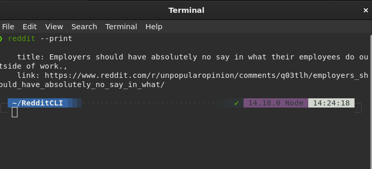

# Silly-Reddit-CLI
A really basic CLI which outputs a random post on terminal or in the browser according to what flag we pass.

I made this CLI during  "Introduction to Nodejs, v2" course by "Scott Moss".
You can also refer to his notes [here](https://intro-to-nodejs-v2-site.vercel.app/lesson/09-clis)

<div align="center">

</div>

## Prerequisites
Ensure you have node version greater than 14.0.0. 

## Steps to install

1.First clone the repo
```
git clone https://github.com/enraiha0307/Silly-Reddit-CLI.git

```
2. Change directory to our repo

```
cd Silly-Reddit-CLI
```
3. Run
 ```
 npm install or npm i
 ```
4. Now we'll have to install our reddit cli as global so run from inside our repo
```
npm install -g
```
5. Now type reddit commands:
```
reddit --print //prints a randompost and its link on the terminal
reddit  //opens up the post in your default browser
```


